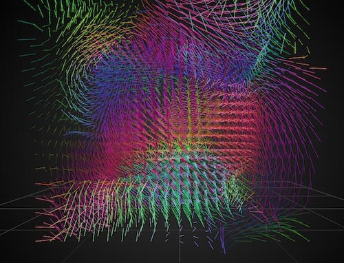

## Understanding Code

NoiseGrid3D was written by Andreas Müller and came from his NoiseWorkshopSketchpad. In order to understand the code better, this version has been reformatted so there is both a .h file and a .cpp file. It also has comments explaining what each part of the code does.

